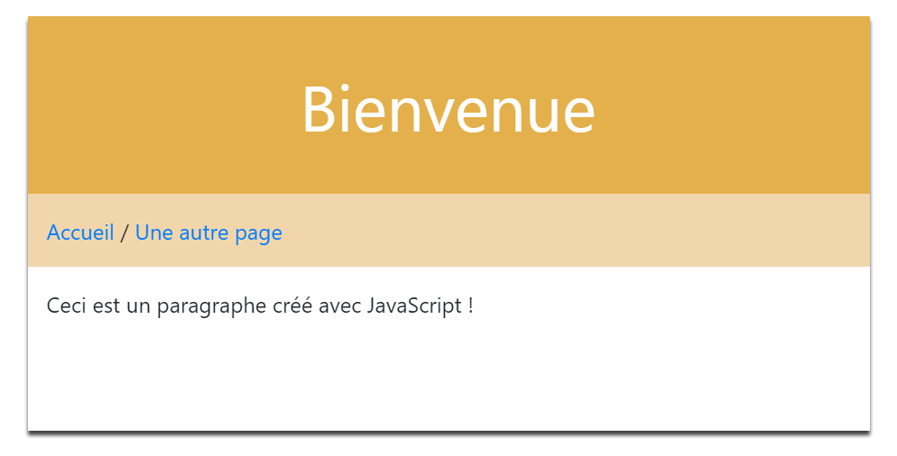

# Projet 2 : Pratiquons tout ce que nous venons de voir

## Que devez-vous faire ?

Nous venons de voir ensemble un tout nouveau concept : la synchronisation entre JavaScript et un site internet ! Nous avons vu ensemble comment ajouter, modifier et supprimer des éléments. Dans cet exercice, je vais donc vous demander de reprendre tout ce que nous venons de voir.

Voici ce que j’aimerai que vous reproduisiez :

Pour réaliser cet exercice, vous allez devoir :
- Supprimer le div avec l'id #a-supprimer
- Créer un header
- Créer un sous-header
- Créer un paragraphe

Tout ceci dynamiquement grâce à JavaScript.

## Codes couleurs :

Je vous invite à vous lancer dans votre imagination, mais toutefois, je sais à quel point parfois, nous ne voulons pas nous prendre la tête ! Si vous le souhaitez, vous pouvez donc reprendre mes couleurs :

- header - **#e3b04b**
- sous-header - **#f1d6ab**

Je ne vous aide pas plus, j'ai juste trois règles pour réussir ce projet :
- **Votre fichier CSS doit rester vide**
- **Votre fichier HTML ne doit pas être modifié (donc vous ne devez pas toucher au code déjà présent)**
- **Amusez-vous ! Ne vous bloquez pas : "Est-ce que je pourrai faire plus simple ?", le principal, c'est que vous réussissiez ce projet :)**

Bon courage !